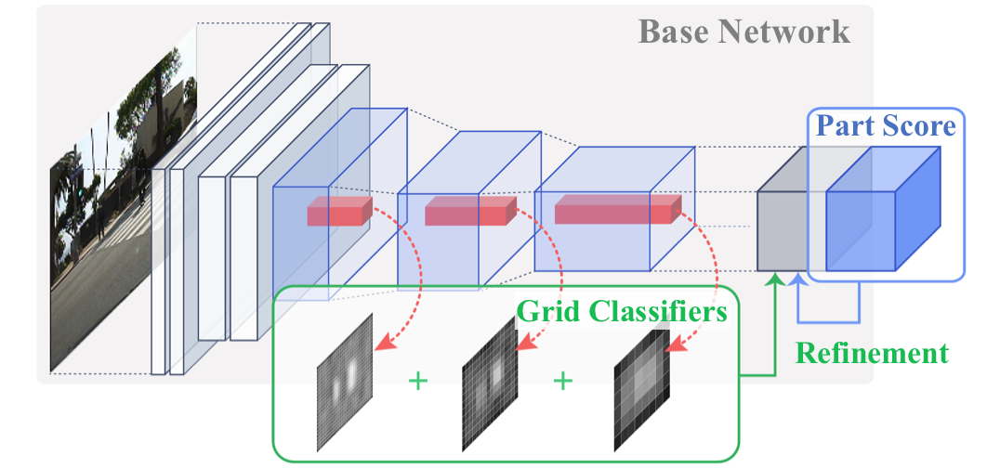

# Improving Occlusion and Hard Negative Handling for Single-Stage Pedestrian Detectors

  

This project hosts the details for our **CVPR 2018** paper.

- Junhyug Noh, Soochan Lee, Beomsu Kim, and Gunhee Kim. Improving Occlusion and Hard Negative Handling for Single-Stage Object Detectors. In *CVPR*, 2018.

We propose methods of addressing two critical issues of pedestrian detection: (i) occlusion of target objects as false negative failure, and (ii) confusion with hard negative examples like vertical structures as false positive failure. Our solutions to these two problems are general and flexible enough to be applicable to any single-stage detection models. Specifically, our two solutions are as follows. For better occlusion handling, we update the output tensors of single-stage models so that they include the prediction of part confidence scores, from which we compute a final occlusion-aware detection score. For reducing confusion with hard negative examples, we introduce average grid classifiers as post-refinement classifiers, trainable in an end-to-end fashion with little memory and time overhead.

## Acknowledgements

The authors would like to thank [Yunseok Jang](https://yunseokjang.github.io/) and [Juyong Kim](http://juyongkim.com/) for helpful discussions, as well as Sukyung Jeong for assisting to draw the figures in the paper.

## Authors

[Junhyug Noh](https://sites.google.com/a/vision.snu.ac.kr/jhnoh/), [Soochan Lee](http://vision.snu.ac.kr/people/soochanlee.html), [Beomsu Kim](http://shuuki4.github.io/myself/) and [Gunhee Kim](http://vision.snu.ac.kr/~gunhee/)\
[Vision and Learning Lab](http://vision.snu.ac.kr/) @ Computer Science and Engineering, Seoul National University, Seoul, Korea
